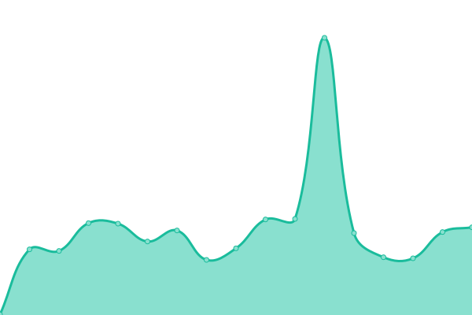
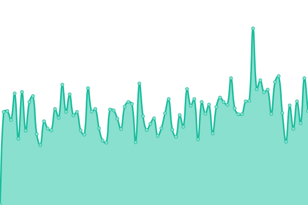

# [📈 Live Status](https://amsterdam.github.io/amsterdam-uptime): <!--live status--> **🟧 Partial outage**

This repository contains the open-source uptime monitor and status page for [Gemeente Amsterdam](https://data.amsterdam.nl), powered by [Upptime](https://github.com/upptime/upptime).

With [Upptime](https://upptime.js.org), you can get your own unlimited and free uptime monitor and status page, powered entirely by a GitHub repository. We use [Issues](https://github.com/amsterdam/amsterdam-uptime/issues) as incident reports, [Actions](https://github.com/amsterdam/amsterdam-uptime/actions) as uptime monitors, and [Pages](https://amsterdam.github.io/amsterdam-uptime) for the status page.

<!--start: status pages-->
<!-- This summary is generated by Upptime (https://github.com/upptime/upptime) -->
<!-- Do not edit this manually, your changes will be overwritten -->
<!-- prettier-ignore -->
| URL | Status | History | Response Time | Uptime |
| --- | ------ | ------- | ------------- | ------ |
|  DSO-API | 🟥 Down | [dso-api.yml](https://github.com/Amsterdam/amsterdam-uptime/commits/HEAD/history/dso-api.yml) | 

 0ms
     
 | 

<a href="https://amsterdam.github.io/amsterdam-uptime/history/dso-api">80.03%</a>
    

|  Geosearch | 🟥 Down | [geosearch.yml](https://github.com/Amsterdam/amsterdam-uptime/commits/HEAD/history/geosearch.yml) | 

 0ms
     
 | 

<a href="https://amsterdam.github.io/amsterdam-uptime/history/geosearch">86.26%</a>
    

|  Atlas | 🟥 Down | [atlas.yml](https://github.com/Amsterdam/amsterdam-uptime/commits/HEAD/history/atlas.yml) | 

 0ms
     
 | 

<a href="https://amsterdam.github.io/amsterdam-uptime/history/atlas">86.27%</a>
    

|  DSO-API Catalog | 🟥 Down | [dso-api-catalog.yml](https://github.com/Amsterdam/amsterdam-uptime/commits/HEAD/history/dso-api-catalog.yml) | 

 0ms
     
 | 

<a href="https://amsterdam.github.io/amsterdam-uptime/history/dso-api-catalog">86.28%</a>
    

|  Mapserver | 🟥 Down | [mapserver.yml](https://github.com/Amsterdam/amsterdam-uptime/commits/HEAD/history/mapserver.yml) | 

 0ms
     
 | 

<a href="https://amsterdam.github.io/amsterdam-uptime/history/mapserver">86.28%</a>
    

|  DCATD | 🟩 Up | [dcatd.yml](https://github.com/Amsterdam/amsterdam-uptime/commits/HEAD/history/dcatd.yml) | 

 488ms
     
 | 

<a href="https://amsterdam.github.io/amsterdam-uptime/history/dcatd">66.76%</a>
    

|  Panoramas | 🟥 Down | [panoramas.yml](https://github.com/Amsterdam/amsterdam-uptime/commits/HEAD/history/panoramas.yml) | 

 0ms
     
 | 

<a href="https://amsterdam.github.io/amsterdam-uptime/history/panoramas">86.33%</a>
    

<!--end: status pages-->

[**Visit our status website →**](https://amsterdam.github.io/amsterdam-uptime)

## 📄 License

- Powered by: [Upptime](https://github.com/upptime/upptime)
- Code: [MIT](./LICENSE) © [Anand Chowdhary](https://anandchowdhary.com), supported by [Pabio](https://pabio.com)
- Data in the `./history` directory: [Open Database License](https://opendatacommons.org/licenses/odbl/1-0/)
