# [📈 Live Status](https://amsterdam.github.io/amsterdam-uptime): <!--live status--> **🟩 All systems operational**

This repository contains the open-source uptime monitor and status page for [Gemeente Amsterdam](https://data.amsterdam.nl), powered by [Upptime](https://github.com/upptime/upptime).

With [Upptime](https://upptime.js.org), you can get your own unlimited and free uptime monitor and status page, powered entirely by a GitHub repository. We use [Issues](https://github.com/amsterdam/amsterdam-uptime/issues) as incident reports, [Actions](https://github.com/amsterdam/amsterdam-uptime/actions) as uptime monitors, and [Pages](https://amsterdam.github.io/amsterdam-uptime) for the status page.

<!--start: status pages-->
<!-- This summary is generated by Upptime (https://github.com/upptime/upptime) -->
<!-- Do not edit this manually, your changes will be overwritten -->
<!-- prettier-ignore -->
| URL | Status | History | Response Time | Uptime |
| --- | ------ | ------- | ------------- | ------ |
|  DSO-API | 🟩 Up | [dso-api.yml](https://github.com/Amsterdam/amsterdam-uptime/commits/HEAD/history/dso-api.yml) | 

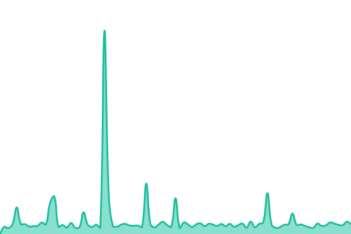 1099ms
     
 | 

<a href="https://amsterdam.github.io/amsterdam-uptime/history/dso-api">99.27%</a>
    

|  DSO-API Catalog | 🟩 Up | [dso-api-catalog.yml](https://github.com/Amsterdam/amsterdam-uptime/commits/HEAD/history/dso-api-catalog.yml) | 

 489ms
     
 | 

<a href="https://amsterdam.github.io/amsterdam-uptime/history/dso-api-catalog">100.00%</a>
    

|  API Key Server | 🟩 Up | [api-key-server.yml](https://github.com/Amsterdam/amsterdam-uptime/commits/HEAD/history/api-key-server.yml) | 

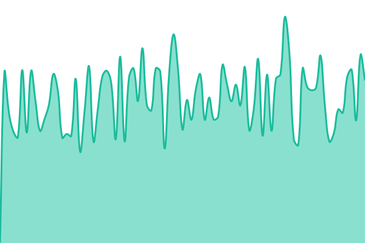 420ms
     
 | 

<a href="https://amsterdam.github.io/amsterdam-uptime/history/api-key-server">100.00%</a>
    

|  Amsterdam Schema | 🟩 Up | [amsterdam-schema.yml](https://github.com/Amsterdam/amsterdam-uptime/commits/HEAD/history/amsterdam-schema.yml) | 

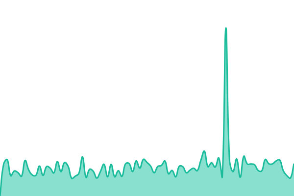 416ms
     
 | 

<a href="https://amsterdam.github.io/amsterdam-uptime/history/amsterdam-schema">100.00%</a>
    

|  BRP Bevragingen | 🟩 Up | [brp-bevragingen.yml](https://github.com/Amsterdam/amsterdam-uptime/commits/HEAD/history/brp-bevragingen.yml) | 

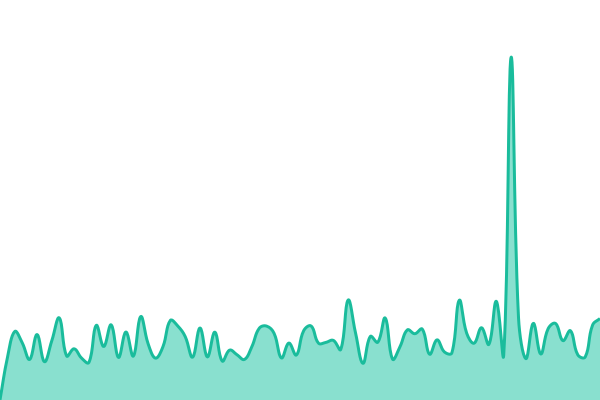 449ms
     
 | 

<a href="https://amsterdam.github.io/amsterdam-uptime/history/brp-bevragingen">100.00%</a>
    

|  BRP Kennisgvingen | 🟩 Up | [brp-kennisgvingen.yml](https://github.com/Amsterdam/amsterdam-uptime/commits/HEAD/history/brp-kennisgvingen.yml) | 

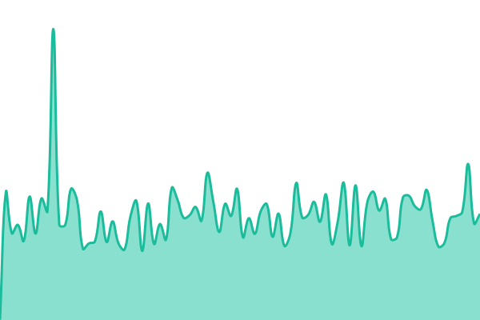 388ms
     
 | 

<a href="https://amsterdam.github.io/amsterdam-uptime/history/brp-kennisgvingen">100.00%</a>
    

|  BRP Acc Bevragingen | 🟩 Up | [brp-acc-bevragingen.yml](https://github.com/Amsterdam/amsterdam-uptime/commits/HEAD/history/brp-acc-bevragingen.yml) | 

 410ms
     
 | 

<a href="https://amsterdam.github.io/amsterdam-uptime/history/brp-acc-bevragingen">100.00%</a>
    

|  BRP Acc Kennisgvingen | 🟩 Up | [brp-acc-kennisgvingen.yml](https://github.com/Amsterdam/amsterdam-uptime/commits/HEAD/history/brp-acc-kennisgvingen.yml) | 

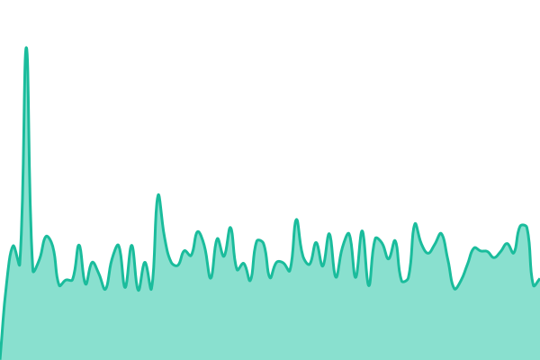 398ms
     
 | 

<a href="https://amsterdam.github.io/amsterdam-uptime/history/brp-acc-kennisgvingen">100.00%</a>
    

|  Geosearch | 🟩 Up | [geosearch.yml](https://github.com/Amsterdam/amsterdam-uptime/commits/HEAD/history/geosearch.yml) | 

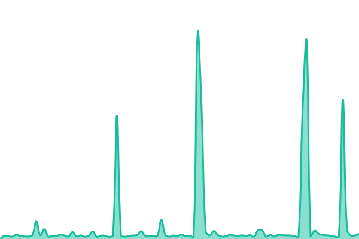 1581ms
     
 | 

<a href="https://amsterdam.github.io/amsterdam-uptime/history/geosearch">98.15%</a>
    

|  Mapserver | 🟩 Up | [mapserver.yml](https://github.com/Amsterdam/amsterdam-uptime/commits/HEAD/history/mapserver.yml) | 

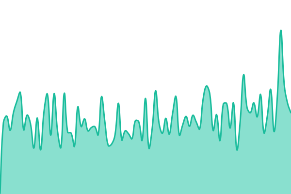 458ms
     
 | 

<a href="https://amsterdam.github.io/amsterdam-uptime/history/mapserver">99.81%</a>
    

|  Mapproxy | 🟩 Up | [mapproxy.yml](https://github.com/Amsterdam/amsterdam-uptime/commits/HEAD/history/mapproxy.yml) | 

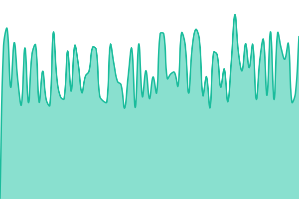 585ms
     
 | 

<a href="https://amsterdam.github.io/amsterdam-uptime/history/mapproxy">99.93%</a>
    

|  Panoramas | 🟩 Up | [panoramas.yml](https://github.com/Amsterdam/amsterdam-uptime/commits/HEAD/history/panoramas.yml) | 

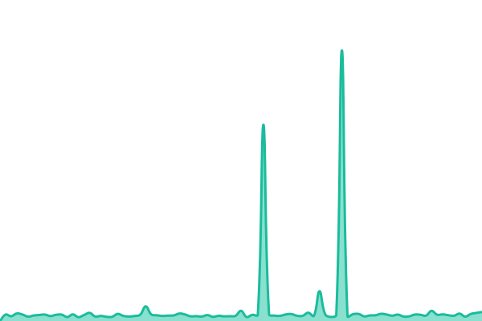 1047ms
     
 | 

<a href="https://amsterdam.github.io/amsterdam-uptime/history/panoramas">99.68%</a>
    

|  Dataselectie | 🟩 Up | [dataselectie.yml](https://github.com/Amsterdam/amsterdam-uptime/commits/HEAD/history/dataselectie.yml) | 

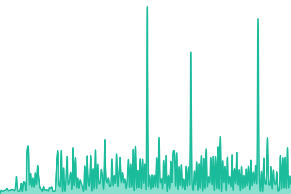 3905ms
     
 | 

<a href="https://amsterdam.github.io/amsterdam-uptime/history/dataselectie">84.60%</a>
    

<!--end: status pages-->

[**Visit our status website →**](https://amsterdam.github.io/amsterdam-uptime)

## 📄 License

- Powered by: [Upptime](https://github.com/upptime/upptime)
- Code: [MIT](./LICENSE) © [Anand Chowdhary](https://anandchowdhary.com), supported by [Pabio](https://pabio.com)
- Data in the `./history` directory: [Open Database License](https://opendatacommons.org/licenses/odbl/1-0/)
